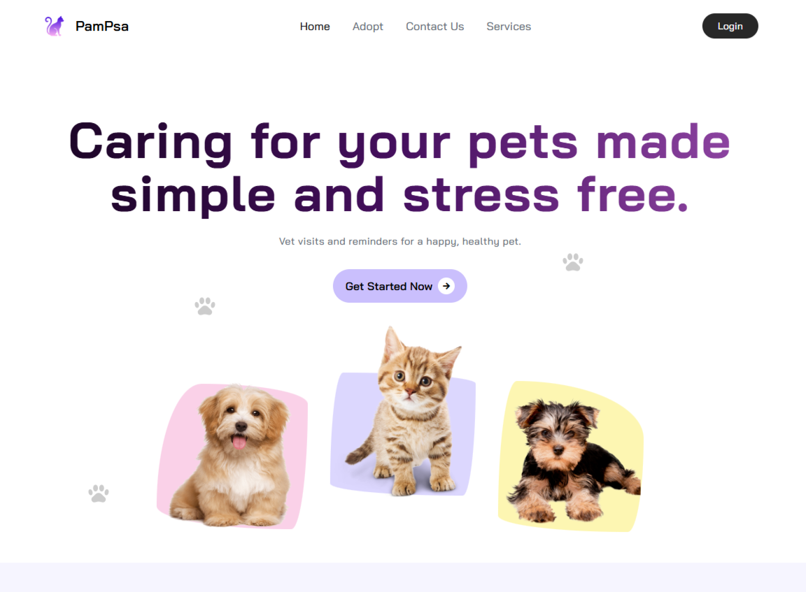

## Project Description:  
**PamiętamPsa** is a web application that allows users to track their pets’ activities, appointments, and care routines. The system enables pet owners to set reminders for vaccinations, feeding schedules, grooming sessions, and medical checkups. With a responsive and interactive design, users can effortlessly navigate and organize their pet-related tasks.  

🌐 [pamietampsa.netlify.app](https://pamietampsa.netlify.app)

## Features:  
1. **User Authentication**: Secure login and signup functionality. **[In-progress]**
2. **Pet Profile Management**: Add, edit, and view pet details such as name, age, breed, and medical history.  **[In-progress]**
3. **Care Reminders**: Schedule notifications for pet-related tasks like feeding, vet visits, and grooming.  **[In-progress]**
4. **Responsive Design**: Optimized for both desktop and mobile use.  

## Technologies Used:  
- **Vue.js** (Frontend framework)  
- **Tailwind CSS** (Styling)  
- **Vue Router** (Navigation)  
- **Axios** (API communication with backend)  

Feel free to contribute, report issues, or suggest enhancements on GitHub. Your feedback and contributions are welcome to improve the **PamiętamPsa** experience!  
